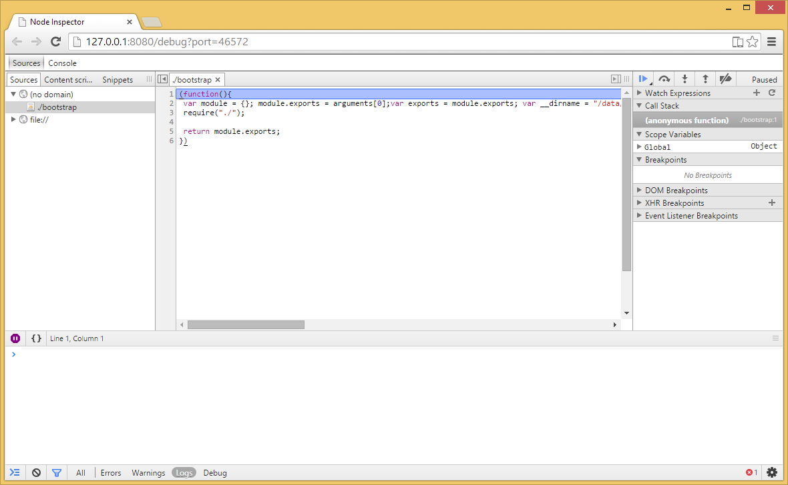

# Overview

Since NativeScript for Android embeds a JavaScript virtual machine (namely [Google's V8](https://code.google.com/p/v8/)) to process the JavaScript code, it also takes advantage of the debugger tools available for this virtual machine. These are [Node Inspector](https://github.com/node-inspector/node-inspector) and [Chrome Developer Tools](https://developer.chrome.com/devtools/index).

> The article assumes that you are familiar with [JavaScript debugging in the Chrome Developer Tools](https://developer.chrome.com/devtools/docs/javascript-debugging). The required node-inspector package is installed by the CLI. You will also need the Chrome web browser installed locally.

The current implementation supports two major scenarios:

  * Start debugging - starts an application with the debugger enabled
  * Attach/Detach debugger - attach/detach the debugger to a running application

# Start an application with the debugger enabled

The following command will build, deploy and run the application with the debugger attached:

```bash
tns debug android --debug-brk
```
Behind the scenes the `debug` command, together with the `--debug-brk` option, will build and start the application and then it will find an available port and enable V8's debugger on that port. Finally, it will start Node Inspector and launch Chrome browser.



> In this case the debugger will automatically break at the first JavaScript statement.

# Setting breakpoints in JavaScript
The global `debugger` statement causes V8 to stop program execution and start a debugging session at the line where it was called. It is equivalent to setting a "manual" breakpoint in the Sources tab of Chrome DevTools.

> See [this article](https://developer.chrome.com/devtools/docs/console#setting-breakpoints-in-javascript) for more information.

# Attach the debugger

If you have a running application you can attach the debugger with the following command:

```bash
tns debug android --start
```

> As in the previous scenario, the `debug` command will configure the V8 debugger port, forward the port, start Node Inspector and launch Chrome browser. It will however will not automatically break and will only hit manually breakpoints.

# Detach the debugger
You can detach the debugger from an already debugged application using the following command:

```bash
tns debug android --stop
```

# Miscellaneous

You can check whether a debugger is enabled with the following command:

```bash
tns debug android --get-port
```

It will return the current debugger port, 0 otherwise.

> The current implementation has hard-coded 30 seconds timeout for establishing a connection between the command line tool and the device/emulator.

# See Also
* [Node Inspector](https://github.com/node-inspector/node-inspector).
* [Chrome Developer Tools](https://developer.chrome.com/devtools/index).
* [JavaScript debugging](https://developer.chrome.com/devtools/docs/javascript-debugging).
* [debugger; statement](https://developer.chrome.com/devtools/docs/console#setting-breakpoints-in-javascript)

